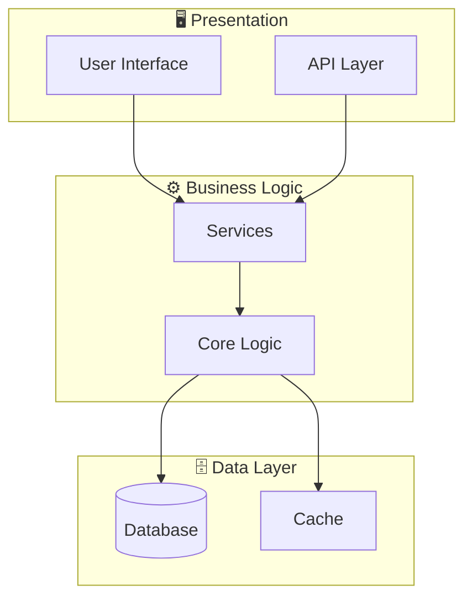
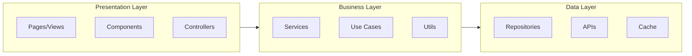

# System Architecture - 2933b6e9-c4bf-421a-a5c5-6716a3ca2899

## Architecture Overview

**Pattern:** Procedural/Monolithic



## Application Layers



## Technology Stack

| Layer | Technology | Purpose |
|-------|------------|---------|
| Language | C | Main language |

## Directory Structure

```
performance_c/
├── ddos_detector.c/
└── (1 files)
```

---

*Generated by Code Analysis Agent on February 10, 2026*
