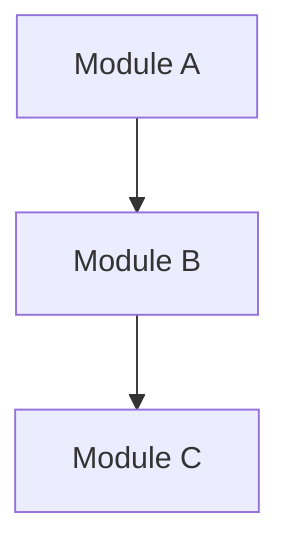

# Dependency Graph - f05450de-6c6c-4e9e-b6bc-220be8d32362

## Statistics

| Metric | Value |
|--------|-------|
| Total Files | 1 |
| Total Functions | 0 |
| Total Classes | 0 |

## Overview

## Most Connected Modules

Connection data not available.

---

*Generated by Code Analysis Agent on February 10, 2026*
